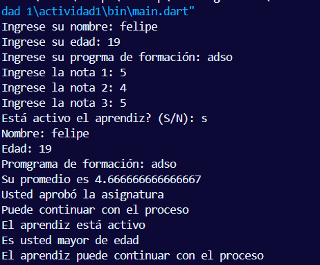

# Primera Actividad En Dart

## 1. Nombre Del Aprendiz
Felipe Echeverri David

## 2. Número De Ficha
3256538

## 3. Programa De Formación
Análisis y Desarrollo de Software (ADSO)

## 4. Descripción del proyecto 
Creación de  un programa basico para aprender conocimientos basicos de dart y flutter, dónde se le pide al usuario información basica y se hacen algunos algoritmos 

## 5. Objetivo de la actividad
Aprender las bases de dart y flutter 

## 6. Temas trabajdos
- Entrada y salida de datos por consola (`stdin`/`stdout`).
- Conversión de tipos de datos (`String` a `int` y `double`).
- Declaración y uso de variables.
- Operadores aritméticos (cálculo del promedio).
- Estructuras condicionales (`if` / `else`).
- Operadores lógicos (`&&`).
- Interpolación de cadenas (`String interpolation`).
- Impresión de resultados formateados con `print()`.

## 7. Instrucciones para ejecutar el programa
1. Tener instalado el [SDK de Dart](https://dart.dev/get-dart) (versión `^3.12.2` o superior).
2. Clonar o descargar este repositorio.
3. Abrir una terminal en la carpeta del proyecto `PrimeraActividadDart`.
4. Instalar las dependencias del proyecto:
   ```
   dart pub get
   ```
5. Ejecutar el programa:
   ```
   dart run bin/dart_application_1.dart
   ```
6. Ingresar los datos solicitados por consola en el siguiente orden:
   - Nombre del aprendiz.
   - Edad.
   - Programa de formación.
   - Centro de formación.
   - Nota 1, Nota 2 y Nota 3.
   - Estado de actividad (si/no).
7. Revisar el resumen de resultados que se muestra en la consola.

## 8. Evidencia de ejecución
La evidencia de ejecución del programa se encuentra en la carpeta [`Evidencias`](Evidencias/image.png).




## 9. Preguntas de reflexión
**¿Por qué es importante validar los datos de entrada en un programa?**
Es importante validar validar los datos que nos ingresa el usuario porque debemos validar que el tipo de dato si coincida con el estamos pdiiendo, tambien al validar evitamos que nos den datos incorrectos 

**¿Qué ventajas ofrece Dart para el manejo de tipos de datos frente a otros lenguajes?**
Dart ofrece la ventaja de que maneja los tipos de datos de forma segura y fácil de entender. Permite detectar errores de tipo antes de ejecutar el programa, lo que ayuda a evitar fallos. Además, puede inferir el tipo de una variable usando var, haciendo el código más corto y fácil de escribir sin perder seguridad.

**¿Cómo aporta este ejercicio al desarrollo de aplicaciones móviles?**
Este ejercicio nos aporta mucho para este tipo de desarrollo pues nos da un inicio de saber como utilizar este lenguaje, tambien nos aportó como hacer validaciones en este lenguaje 

## 10. Conclusión de la actividad
Con esta actividad se reforzaron los conocimientos básicos de Dart mediante un ejercicio práctico. Se aprendió a usar variables, leer y validar datos desde la consola, aplicar estructuras condicionales y mostrar información en pantalla. Estos conocimientos son importantes porque sirven como base para seguir aprendiendo y desarrollar aplicaciones móviles con Flutter.